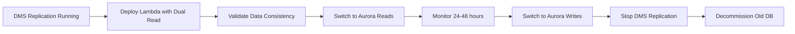

# Aurora PostgreSQL Migration Guide

## ?? Overview

This guide covers migrating from local PostgreSQL development to AWS-hosted Aurora PostgreSQL for production. Your `AuroraClient` is already designed to support both environments seamlessly!

**Key Principle**: The code stays the same, only infrastructure and environment variables change.

---

## ??? Architecture Comparison

### Current (Local Development)
```
???????????????      ????????????????????
?   Lambda    ????????  PostgreSQL      ?
?  (Local)    ?      ?  (Docker)        ?
???????????????      ????????????????????
                      Port: 5432
                      SSL: false
```

### Target (AWS Production)
```
???????????????      ????????????????      ????????????????????
?   Lambda    ????????  RDS Proxy   ????????  Aurora          ?
?   (VPC)     ?      ?  (Optional)  ?      ?  PostgreSQL      ?
???????????????      ????????????????      ????????????????????
                      Connection pooling     Multi-AZ cluster
                      IAM auth               SSL: true
```

---

## ?? Migration Path

### Phase 1: AWS Infrastructure Setup

#### 1.1 Create Aurora PostgreSQL Cluster

**Via AWS Console:**
1. Navigate to RDS ? Create database
2. Choose **Aurora (PostgreSQL Compatible)**
3. Configuration:
   - Engine version: **PostgreSQL 16.x** (matches your local setup)
   - Template: **Production** or **Dev/Test**
   - DB cluster identifier: `spacecat-aurora-cluster`
   - Master username: `admin`
   - Master password: Store in Secrets Manager

4. Instance configuration:
   - **Production**: `db.r6g.large` or `db.r6g.xlarge`
   - **Staging**: `db.t4g.medium`
   - Consider **Aurora Serverless v2** for cost optimization

5. Availability & durability:
   - Multi-AZ deployment: **Yes** (production)
   - Create Aurora Replica: **Yes** (1-2 read replicas)

6. Connectivity:
   - VPC: Your application VPC
   - Subnet group: Create new or use existing
   - Public access: **No**
   - VPC security group: Create `spacecat-aurora-sg`

7. Additional configuration:
   - Initial database name: `spacecatdb`
   - DB cluster parameter group: Default
   - Enable encryption: **Yes**
   - Enable Performance Insights: **Yes**
   - Enable Enhanced Monitoring: **Yes**
   - Backup retention: 7-30 days

**Via Terraform:**
```hcl
resource "aws_rds_cluster" "spacecat_aurora" {
  cluster_identifier      = "spacecat-aurora-cluster"
  engine                  = "aurora-postgresql"
  engine_version          = "16.1"
  database_name           = "spacecatdb"
  master_username         = "admin"
  master_password         = var.db_master_password
  
  vpc_security_group_ids  = [aws_security_group.aurora.id]
  db_subnet_group_name    = aws_db_subnet_group.aurora.name
  
  backup_retention_period = 7
  preferred_backup_window = "03:00-04:00"
  
  enabled_cloudwatch_logs_exports = ["postgresql"]
  
  storage_encrypted       = true
  kms_key_id             = aws_kms_key.aurora.arn
  
  tags = {
    Name        = "SpaceCat Aurora Cluster"
    Environment = var.environment
  }
}

resource "aws_rds_cluster_instance" "spacecat_aurora_instance" {
  count              = 2  # Primary + 1 replica
  identifier         = "spacecat-aurora-instance-${count.index}"
  cluster_identifier = aws_rds_cluster.spacecat_aurora.id
  instance_class     = "db.r6g.large"
  engine             = aws_rds_cluster.spacecat_aurora.engine
  engine_version     = aws_rds_cluster.spacecat_aurora.engine_version
  
  performance_insights_enabled = true
  monitoring_interval          = 60
  monitoring_role_arn          = aws_iam_role.rds_monitoring.arn
}
```

#### 1.2 Network & Security Setup

**VPC Configuration:**
```hcl
# Security group for Aurora
resource "aws_security_group" "aurora" {
  name        = "spacecat-aurora-sg"
  description = "Security group for Aurora PostgreSQL"
  vpc_id      = var.vpc_id
  
  ingress {
    from_port       = 5432
    to_port         = 5432
    protocol        = "tcp"
    security_groups = [aws_security_group.lambda.id]
    description     = "PostgreSQL from Lambda"
  }
  
  egress {
    from_port   = 0
    to_port     = 0
    protocol    = "-1"
    cidr_blocks = ["0.0.0.0/0"]
  }
}

# Security group for Lambda
resource "aws_security_group" "lambda" {
  name        = "spacecat-lambda-sg"
  description = "Security group for Lambda functions"
  vpc_id      = var.vpc_id
  
  egress {
    from_port   = 0
    to_port     = 0
    protocol    = "-1"
    cidr_blocks = ["0.0.0.0/0"]
  }
}
```

**IAM Role for RDS Monitoring:**
```hcl
resource "aws_iam_role" "rds_monitoring" {
  name = "spacecat-rds-monitoring-role"
  
  assume_role_policy = jsonencode({
    Version = "2012-10-17"
    Statement = [{
      Action = "sts:AssumeRole"
      Effect = "Allow"
      Principal = {
        Service = "monitoring.rds.amazonaws.com"
      }
    }]
  })
}

resource "aws_iam_role_policy_attachment" "rds_monitoring" {
  role       = aws_iam_role.rds_monitoring.name
  policy_arn = "arn:aws:iam::aws:policy/service-role/AmazonRDSEnhancedMonitoringRole"
}
```

#### 1.3 RDS Proxy Setup (Recommended)

**Benefits:**
- Connection pooling and multiplexing
- Automatic failover (< 30 seconds)
- IAM database authentication
- Graceful connection handling during scaling

**Terraform:**
```hcl
resource "aws_db_proxy" "spacecat" {
  name                   = "spacecat-aurora-proxy"
  engine_family          = "POSTGRESQL"
  auth {
    auth_scheme = "SECRETS"
    iam_auth    = "REQUIRED"
    secret_arn  = aws_secretsmanager_secret.aurora_credentials.arn
  }
  
  role_arn               = aws_iam_role.proxy.arn
  vpc_subnet_ids         = var.private_subnet_ids
  vpc_security_group_ids = [aws_security_group.aurora_proxy.id]
  
  require_tls = true
  
  tags = {
    Name = "SpaceCat Aurora Proxy"
  }
}

resource "aws_db_proxy_default_target_group" "spacecat" {
  db_proxy_name = aws_db_proxy.spacecat.name
  
  connection_pool_config {
    max_connections_percent      = 100
    max_idle_connections_percent = 50
    connection_borrow_timeout    = 120
  }
}

resource "aws_db_proxy_target" "spacecat" {
  db_proxy_name         = aws_db_proxy.spacecat.name
  target_group_name     = aws_db_proxy_default_target_group.spacecat.name
  db_cluster_identifier = aws_rds_cluster.spacecat_aurora.cluster_identifier
}
```

#### 1.4 Secrets Manager Setup

```hcl
resource "aws_secretsmanager_secret" "aurora_credentials" {
  name        = "spacecat/aurora/credentials"
  description = "Aurora PostgreSQL credentials"
  
  recovery_window_in_days = 7
}

resource "aws_secretsmanager_secret_version" "aurora_credentials" {
  secret_id = aws_secretsmanager_secret.aurora_credentials.id
  secret_string = jsonencode({
    username = aws_rds_cluster.spacecat_aurora.master_username
    password = var.db_master_password
    engine   = "postgres"
    host     = aws_rds_cluster.spacecat_aurora.endpoint
    port     = 5432
    dbname   = aws_rds_cluster.spacecat_aurora.database_name
  })
}

# Lambda IAM policy to access secret
resource "aws_iam_policy" "lambda_secrets_access" {
  name = "spacecat-lambda-secrets-access"
  
  policy = jsonencode({
    Version = "2012-10-17"
    Statement = [{
      Effect = "Allow"
      Action = [
        "secretsmanager:GetSecretValue"
      ]
      Resource = aws_secretsmanager_secret.aurora_credentials.arn
    }]
  })
}
```

---

### Phase 2: Database Migration

#### 2.1 Export from Local PostgreSQL

```bash
#!/bin/bash
# export-local-db.sh

CONTAINER_NAME="spacecat-postgres-local"
DB_NAME="spacecatdb"
DB_USER="spacecatuser"
BACKUP_FILE="spacecat-backup-$(date +%Y%m%d-%H%M%S).dump"

echo "?? Exporting database from local PostgreSQL..."

# Export database
docker exec $CONTAINER_NAME pg_dump \
  -U $DB_USER \
  -d $DB_NAME \
  -F c \
  -b \
  -v \
  -f /tmp/$BACKUP_FILE

# Copy from container to host
docker cp $CONTAINER_NAME:/tmp/$BACKUP_FILE ./$BACKUP_FILE

echo "? Export complete: $BACKUP_FILE"
echo "?? File size: $(du -h $BACKUP_FILE | cut -f1)"
```

#### 2.2 Upload to S3

```bash
#!/bin/bash
# upload-to-s3.sh

BACKUP_FILE=$1
S3_BUCKET="your-spacecat-backups-bucket"
S3_PATH="migrations/$(date +%Y/%m/%d)/$BACKUP_FILE"

echo "??  Uploading to S3..."

aws s3 cp $BACKUP_FILE s3://$S3_BUCKET/$S3_PATH

echo "? Upload complete: s3://$S3_BUCKET/$S3_PATH"
```

#### 2.3 Restore to Aurora

**Option A: Direct Restore (from bastion host or EC2 in VPC)**

```bash
#!/bin/bash
# restore-to-aurora.sh

AURORA_HOST="spacecat-aurora-cluster.cluster-xxx.us-east-1.rds.amazonaws.com"
AURORA_USER="admin"
AURORA_DB="spacecatdb"
BACKUP_FILE=$1

echo "?? Restoring to Aurora PostgreSQL..."

# Download from S3 if needed
aws s3 cp s3://your-bucket/migrations/$BACKUP_FILE ./$BACKUP_FILE

# Restore
PGPASSWORD=$(aws secretsmanager get-secret-value \
  --secret-id spacecat/aurora/credentials \
  --query SecretString \
  --output text | jq -r .password) \
pg_restore \
  -h $AURORA_HOST \
  -U $AURORA_USER \
  -d $AURORA_DB \
  -v \
  --no-owner \
  --no-acl \
  $BACKUP_FILE

echo "? Restore complete!"
```

**Option B: AWS Database Migration Service (DMS)**

For production migrations with minimal downtime:

```hcl
# Terraform for DMS
resource "aws_dms_replication_instance" "spacecat" {
  replication_instance_id   = "spacecat-replication"
  replication_instance_class = "dms.t3.medium"
  allocated_storage          = 100
  vpc_security_group_ids     = [aws_security_group.dms.id]
  replication_subnet_group_id = aws_dms_replication_subnet_group.spacecat.id
}

resource "aws_dms_endpoint" "source" {
  endpoint_id   = "spacecat-source"
  endpoint_type = "source"
  engine_name   = "postgres"
  
  server_name = "your-source-host"
  port        = 5432
  database_name = "spacecatdb"
  username      = "spacecatuser"
  password      = var.source_db_password
}

resource "aws_dms_endpoint" "target" {
  endpoint_id   = "spacecat-target"
  endpoint_type = "target"
  engine_name   = "aurora-postgresql"
  
  server_name   = aws_rds_cluster.spacecat_aurora.endpoint
  port          = 5432
  database_name = "spacecatdb"
  username      = "admin"
  password      = var.db_master_password
}

resource "aws_dms_replication_task" "spacecat" {
  replication_task_id = "spacecat-migration"
  migration_type      = "full-load-and-cdc"
  
  replication_instance_arn = aws_dms_replication_instance.spacecat.replication_instance_arn
  source_endpoint_arn      = aws_dms_endpoint.source.endpoint_arn
  target_endpoint_arn      = aws_dms_endpoint.target.endpoint_arn
  
  table_mappings = jsonencode({
    rules = [{
      rule-type = "selection"
      rule-id   = "1"
      rule-name = "1"
      object-locator = {
        schema-name = "spacecat"
        table-name  = "%"
      }
      rule-action = "include"
    }]
  })
}
```

---

### Phase 3: Lambda Configuration

#### 3.1 Update Lambda VPC Configuration

Your Lambda functions must be in the same VPC as Aurora:

```hcl
resource "aws_lambda_function" "spacecat_api" {
  function_name = "spacecat-api-service"
  role          = aws_iam_role.lambda.arn
  
  vpc_config {
    subnet_ids         = var.private_subnet_ids  # Private subnets with NAT
    security_group_ids = [aws_security_group.lambda.id]
  }
  
  environment {
    variables = {
      # Aurora configuration
      AURORA_HOST             = aws_db_proxy.spacecat.endpoint  # Use proxy
      AURORA_PORT             = "5432"
      AURORA_DATABASE         = "spacecatdb"
      AURORA_SECRET_ARN       = aws_secretsmanager_secret.aurora_credentials.arn
      AURORA_SSL              = "true"
      AURORA_MAX_CONNECTIONS  = "5"  # Lower with RDS Proxy
      
      # Enable Aurora queries
      ENABLE_AURORA_QUERIES = "true"
    }
  }
  
  timeout     = 30
  memory_size = 1024
}
```

#### 3.2 Lambda IAM Permissions

```hcl
resource "aws_iam_role_policy" "lambda_aurora_access" {
  name = "aurora-access"
  role = aws_iam_role.lambda.id
  
  policy = jsonencode({
    Version = "2012-10-17"
    Statement = [
      {
        Effect = "Allow"
        Action = [
          "rds-db:connect"
        ]
        Resource = [
          "arn:aws:rds-db:${var.region}:${data.aws_caller_identity.current.account_id}:dbuser:*/*"
        ]
      },
      {
        Effect = "Allow"
        Action = [
          "secretsmanager:GetSecretValue"
        ]
        Resource = aws_secretsmanager_secret.aurora_credentials.arn
      },
      {
        Effect = "Allow"
        Action = [
          "ec2:CreateNetworkInterface",
          "ec2:DescribeNetworkInterfaces",
          "ec2:DeleteNetworkInterface"
        ]
        Resource = "*"
      }
    ]
  })
}
```

---

### Phase 4: Code Enhancements (Optional)

#### 4.1 Add Secrets Manager Support

Update `aurora-client.js` to fetch credentials from Secrets Manager:

```javascript
import { SecretsManagerClient, GetSecretValueCommand } from '@aws-sdk/client-secrets-manager';

static async fromContext(context) {
    const { env } = context;
    
    // Fetch credentials from Secrets Manager if ARN provided
    let credentials = {
        user: env.AURORA_USER || env.POSTGRES_USER,
        password: env.AURORA_PASSWORD || env.POSTGRES_PASSWORD,
    };
    
    if (env.AURORA_SECRET_ARN) {
        try {
            const client = new SecretsManagerClient({ region: env.AWS_REGION });
            const response = await client.send(
                new GetSecretValueCommand({ SecretId: env.AURORA_SECRET_ARN })
            );
            const secret = JSON.parse(response.SecretString);
            credentials = {
                user: secret.username,
                password: secret.password,
            };
        } catch (error) {
            console.error('Failed to fetch credentials from Secrets Manager:', error);
            // Fall back to environment variables
        }
    }
    
    // ... rest of configuration
    return new AuroraClient({
        host: env.AURORA_HOST || env.POSTGRES_HOST,
        port: env.AURORA_PORT || env.POSTGRES_PORT,
        database: env.AURORA_DATABASE || env.POSTGRES_DATABASE,
        user: credentials.user,
        password: credentials.password,
        max: parseInt(env.AURORA_MAX_CONNECTIONS || '20', 10),
        ssl: sslSetting,
    });
}
```

#### 4.2 Enhanced SSL Configuration

```javascript
import fs from 'fs';
import https from 'https';

constructor(config) {
    // Download RDS CA certificate if not exists
    const caCertPath = '/tmp/rds-ca-2019-root.pem';
    
    // SSL configuration
    let sslConfig = false;
    if (config.ssl) {
        sslConfig = {
            rejectUnauthorized: true,
        };
        
        // Add CA certificate for Aurora
        if (fs.existsSync(caCertPath)) {
            sslConfig.ca = fs.readFileSync(caCertPath);
        }
    }
    
    this.config = {
        // ... other config
        ssl: sslConfig,
    };
    
    this.pool = new Pool(this.config);
}
```

#### 4.3 Connection Pool Optimization

```javascript
// Adjust pool size based on environment
static getOptimalPoolSize(context) {
    const { env } = context;
    
    // With RDS Proxy
    if (env.AURORA_HOST?.includes('proxy')) {
        return 2;  // Small pool, proxy handles multiplexing
    }
    
    // Direct connection
    if (env.NODE_ENV === 'production') {
        return 5;  // Conservative for Lambda
    }
    
    return 20;  // Development
}

static fromContext(context) {
    // ... credentials fetching
    
    return new AuroraClient({
        // ... other config
        max: this.getOptimalPoolSize(context),
    });
}
```

---

### Phase 5: Environment-Specific Configuration

#### Local Development (`.env.development`)
```bash
# Local PostgreSQL
POSTGRES_HOST=localhost
POSTGRES_PORT=5432
POSTGRES_DATABASE=spacecatdb
POSTGRES_USER=spacecatuser
POSTGRES_PASSWORD=spacecatpassword
POSTGRES_SSL=false

# Enable queries
ENABLE_AURORA_QUERIES=true
```

#### Staging (`.env.staging`)
```bash
# Aurora PostgreSQL
AURORA_HOST=spacecat-aurora-proxy-staging.proxy-xxx.us-east-1.rds.amazonaws.com
AURORA_PORT=5432
AURORA_DATABASE=spacecatdb
AURORA_SECRET_ARN=arn:aws:secretsmanager:us-east-1:xxx:secret:spacecat/aurora/staging
AURORA_SSL=true
AURORA_MAX_CONNECTIONS=5

# Enable queries
ENABLE_AURORA_QUERIES=true

# AWS Region
AWS_REGION=us-east-1
```

#### Production (`.env.production`)
```bash
# Aurora PostgreSQL (via RDS Proxy)
AURORA_HOST=spacecat-aurora-proxy-prod.proxy-xxx.us-east-1.rds.amazonaws.com
AURORA_PORT=5432
AURORA_DATABASE=spacecatdb
AURORA_SECRET_ARN=arn:aws:secretsmanager:us-east-1:xxx:secret:spacecat/aurora/production
AURORA_SSL=true
AURORA_MAX_CONNECTIONS=2  # Small with RDS Proxy

# Enable queries
ENABLE_AURORA_QUERIES=true

# AWS Region
AWS_REGION=us-east-1

# Performance
NODE_ENV=production
```

---

## ?? Deployment & Rollout Strategy

### Blue/Green Deployment

```bash
# Phase 1: Deploy with feature flag OFF
ENABLE_AURORA_QUERIES=false
# Still using existing data sources

# Phase 2: Enable for testing
ENABLE_AURORA_QUERIES=true
# Monitor CloudWatch metrics for 24 hours

# Phase 3: Gradual rollout
# Route 10% ? 25% ? 50% ? 100% traffic to new version

# Phase 4: Full cutover
# All traffic on Aurora
```

### Zero-Downtime Migration



**Steps:**
1. **Week 1**: Set up Aurora, start DMS replication
2. **Week 2**: Deploy Lambda with Aurora reads (shadow mode)
3. **Week 3**: Switch primary reads to Aurora
4. **Week 4**: Switch writes to Aurora, stop DMS
5. **Week 5**: Monitor, optimize, decommission old DB

---

## ?? Monitoring & Observability

### CloudWatch Dashboards

Create comprehensive dashboards:

```json
{
  "widgets": [
    {
      "type": "metric",
      "properties": {
        "title": "Database Connections",
        "metrics": [
          ["AWS/RDS", "DatabaseConnections", {"stat": "Average"}]
        ]
      }
    },
    {
      "type": "metric",
      "properties": {
        "title": "CPU Utilization",
        "metrics": [
          ["AWS/RDS", "CPUUtilization", {"stat": "Average"}]
        ]
      }
    },
    {
      "type": "metric",
      "properties": {
        "title": "Query Latency",
        "metrics": [
          ["AWS/RDS", "ReadLatency", {"stat": "Average"}],
          ["AWS/RDS", "WriteLatency", {"stat": "Average"}]
        ]
      }
    }
  ]
}
```

### CloudWatch Alarms

```hcl
resource "aws_cloudwatch_metric_alarm" "aurora_cpu" {
  alarm_name          = "spacecat-aurora-high-cpu"
  comparison_operator = "GreaterThanThreshold"
  evaluation_periods  = "2"
  metric_name         = "CPUUtilization"
  namespace           = "AWS/RDS"
  period              = "300"
  statistic           = "Average"
  threshold           = "80"
  alarm_description   = "Aurora CPU usage is too high"
  alarm_actions       = [aws_sns_topic.alerts.arn]
  
  dimensions = {
    DBClusterIdentifier = aws_rds_cluster.spacecat_aurora.cluster_identifier
  }
}

resource "aws_cloudwatch_metric_alarm" "aurora_connections" {
  alarm_name          = "spacecat-aurora-high-connections"
  comparison_operator = "GreaterThanThreshold"
  evaluation_periods  = "2"
  metric_name         = "DatabaseConnections"
  namespace           = "AWS/RDS"
  period              = "300"
  statistic           = "Average"
  threshold           = "400"  # 80% of max connections
  alarm_description   = "Aurora has too many connections"
  alarm_actions       = [aws_sns_topic.alerts.arn]
  
  dimensions = {
    DBClusterIdentifier = aws_rds_cluster.spacecat_aurora.cluster_identifier
  }
}
```

### Application Logging

Enhance `aurora-client.js` with detailed logging:

```javascript
async query(sql, params = []) {
    const client = await this.pool.connect();
    try {
        const start = Date.now();
        const result = await client.query(sql, params);
        const duration = Date.now() - start;
        
        // Detailed performance logging
        const logData = {
            duration,
            rowCount: result.rows.length,
            query: sql.substring(0, 100),
            poolStats: this.getPoolStats(),
        };
        
        if (duration > 1000) {
            console.warn('Slow query detected:', logData);
        } else {
            console.debug('Query executed:', logData);
        }
        
        return result.rows;
    } catch (error) {
        console.error('Query failed:', {
            error: error.message,
            query: sql.substring(0, 100),
            params,
            poolStats: this.getPoolStats(),
        });
        throw error;
    } finally {
        client.release();
    }
}
```

---

## ?? Performance Optimization

### Connection Pooling Best Practices

```javascript
// For RDS Proxy (recommended)
{
    max: 2,  // Small pool per Lambda
    idleTimeoutMillis: 30000,
    connectionTimeoutMillis: 2000,
}

// For direct Aurora connection (not recommended)
{
    max: 5,  // Moderate pool
    idleTimeoutMillis: 10000,
    connectionTimeoutMillis: 5000,
}
```

### Query Optimization

```sql
-- Create indexes on frequently queried columns
CREATE INDEX idx_audits_site_id ON spacecat.audits(site_id);
CREATE INDEX idx_audits_audit_type ON spacecat.audits(audit_type);
CREATE INDEX idx_audits_created_at ON spacecat.audits(created_at);

-- Composite index for common queries
CREATE INDEX idx_audits_site_type_date 
ON spacecat.audits(site_id, audit_type, created_at);

-- Add statistics
ANALYZE spacecat.audits;
```

### Read Replicas

Route read-heavy queries to replicas:

```javascript
// In aurora-client.js
static fromContext(context) {
    const { env } = context;
    
    return new AuroraClient({
        host: env.AURORA_READER_HOST || env.AURORA_HOST,  // Reader endpoint
        // ... other config
    });
}

// In Lambda
const readerEndpoint = 'spacecat-aurora-cluster.cluster-ro-xxx.us-east-1.rds.amazonaws.com';
```

---

## ?? Cost Optimization

### Aurora Serverless v2

```hcl
resource "aws_rds_cluster" "spacecat_aurora_serverless" {
  cluster_identifier = "spacecat-aurora-serverless"
  engine             = "aurora-postgresql"
  engine_mode        = "provisioned"  # Required for Serverless v2
  
  serverlessv2_scaling_configuration {
    min_capacity = 0.5  # 1 GB RAM
    max_capacity = 16   # 32 GB RAM
  }
}

resource "aws_rds_cluster_instance" "spacecat_aurora_serverless_instance" {
  cluster_identifier = aws_rds_cluster.spacecat_aurora_serverless.id
  instance_class     = "db.serverless"  # Serverless v2 instance
  engine             = aws_rds_cluster.spacecat_aurora_serverless.engine
}
```

**Cost Comparison (us-east-1):**
- **Provisioned** `db.r6g.large`: ~$175/month (24/7)
- **Serverless v2** (0.5-4 ACUs): ~$40-150/month (scales with load)
- **RDS Proxy**: ~$11/month + $0.0015 per connection

### Cost Monitoring

```bash
# Set up AWS Cost Anomaly Detection
aws ce create-anomaly-monitor \
  --anomaly-monitor Name=SpaceCatRDS,ResourceTags=[{Key=Project,Values=[spacecat]}] \
  --monitor-type DIMENSIONAL \
  --monitor-dimension SERVICE
```

---

## ?? Rollback Strategy

### Quick Rollback

```bash
# 1. Switch environment variable
aws lambda update-function-configuration \
  --function-name spacecat-api-service \
  --environment "Variables={ENABLE_AURORA_QUERIES=false}"

# 2. Monitor for 5 minutes
# 3. If stable, keep old config; else, switch back
```

### Full Rollback

```bash
# 1. Keep old database running during migration
# 2. Maintain dual-write capability
# 3. Feature flag controls which DB is primary
# 4. Can switch instantly if issues arise

# Rollback steps:
ENABLE_AURORA_QUERIES=false  # Back to old DB
# or
AURORA_HOST=old-db-host  # Point to old DB
```

---

## ? Migration Checklist

### Pre-Migration
- [ ] Aurora cluster created and configured
- [ ] VPC, subnets, security groups configured
- [ ] RDS Proxy deployed (optional but recommended)
- [ ] Secrets Manager configured with credentials
- [ ] Lambda VPC configuration updated
- [ ] IAM roles and policies configured
- [ ] CloudWatch dashboards and alarms set up

### Migration
- [ ] Database backup exported from local
- [ ] Backup uploaded to S3
- [ ] Schema created in Aurora
- [ ] Data restored to Aurora
- [ ] Data validation completed
- [ ] Indexes and constraints created
- [ ] Statistics analyzed

### Deployment
- [ ] Lambda environment variables updated
- [ ] Lambda deployed to staging
- [ ] Integration tests passed in staging
- [ ] Performance tests passed
- [ ] Lambda deployed to production (with feature flag)
- [ ] Gradual rollout initiated

### Post-Migration
- [ ] Monitoring dashboards reviewed (24 hours)
- [ ] No errors or performance degradation
- [ ] Connection pool stats healthy
- [ ] Query performance acceptable
- [ ] Cost monitoring in place
- [ ] Old database decommissioned

### Documentation
- [ ] Architecture diagrams updated
- [ ] Runbooks created for common operations
- [ ] Troubleshooting guide documented
- [ ] Team trained on new setup

---

## ?? Troubleshooting

### Connection Issues

```bash
# Test connection from Lambda
aws lambda invoke \
  --function-name spacecat-api-service \
  --payload '{"test":"connection"}' \
  response.json

# Check security group rules
aws ec2 describe-security-groups \
  --group-ids sg-xxx \
  --query 'SecurityGroups[0].IpPermissions'

# Check VPC endpoints
aws ec2 describe-vpc-endpoints \
  --filters "Name=vpc-id,Values=vpc-xxx"
```

### High Connection Count

```sql
-- Check active connections
SELECT 
    count(*) as total_connections,
    state,
    application_name
FROM pg_stat_activity
WHERE datname = 'spacecatdb'
GROUP BY state, application_name;

-- Kill idle connections
SELECT pg_terminate_backend(pid)
FROM pg_stat_activity
WHERE state = 'idle'
  AND state_change < now() - interval '10 minutes';
```

### Slow Queries

```sql
-- Enable slow query log
ALTER DATABASE spacecatdb SET log_min_duration_statement = 1000;

-- Find slow queries
SELECT 
    query,
    mean_exec_time,
    calls,
    total_exec_time
FROM pg_stat_statements
ORDER BY mean_exec_time DESC
LIMIT 10;
```

### Connection Pool Exhaustion

```javascript
// Check pool stats in application
console.log('Pool stats:', context.aurora.getPoolStats());

// Adjust pool size
AURORA_MAX_CONNECTIONS=2  // Lower with RDS Proxy
AURORA_MAX_CONNECTIONS=10  // Higher for direct connection
```

---

## ?? Additional Resources

### AWS Documentation
- [Aurora PostgreSQL Best Practices](https://docs.aws.amazon.com/AmazonRDS/latest/AuroraUserGuide/Aurora.BestPractices.html)
- [RDS Proxy Documentation](https://docs.aws.amazon.com/AmazonRDS/latest/UserGuide/rds-proxy.html)
- [Lambda VPC Configuration](https://docs.aws.amazon.com/lambda/latest/dg/configuration-vpc.html)

### Internal Documentation
- [AURORA_QUICKSTART.md](./AURORA_QUICKSTART.md) - Local development setup
- [AURORA_WORKFLOW.md](./AURORA_WORKFLOW.md) - Development workflows
- [API.md](./API.md) - API documentation

### Terraform Modules
```hcl
# Use community modules
module "aurora" {
  source  = "terraform-aws-modules/rds-aurora/aws"
  version = "~> 8.0"
  
  name           = "spacecat-aurora"
  engine         = "aurora-postgresql"
  engine_version = "16.1"
  instance_class = "db.r6g.large"
  instances      = { 1 = {}, 2 = {} }
  
  vpc_id  = var.vpc_id
  subnets = var.private_subnet_ids
  
  create_security_group = true
  allowed_security_groups = [aws_security_group.lambda.id]
  
  storage_encrypted   = true
  apply_immediately   = false
  monitoring_interval = 60
  
  enabled_cloudwatch_logs_exports = ["postgresql"]
  
  tags = {
    Environment = "production"
    Project     = "spacecat"
  }
}
```

---

## ?? Success Criteria

Migration is successful when:
- ? All queries return correct results
- ? Response times < 500ms (p95)
- ? No connection pool exhaustion
- ? Error rate < 0.1%
- ? CPU utilization < 70%
- ? Cost within budget
- ? Zero downtime during cutover
- ? Monitoring and alerts operational
- ? Team can operate and troubleshoot

---

## ?? Support & Escalation

For issues during migration:

1. **Check CloudWatch Logs**
2. **Review RDS Performance Insights**
3. **Examine Lambda metrics**
4. **Check security group rules**
5. **Verify Secrets Manager access**
6. **Test network connectivity**
7. **Rollback if critical**

---

**Remember**: Your `AuroraClient` is already migration-ready! ??

The code doesn't change?only infrastructure and environment variables.

