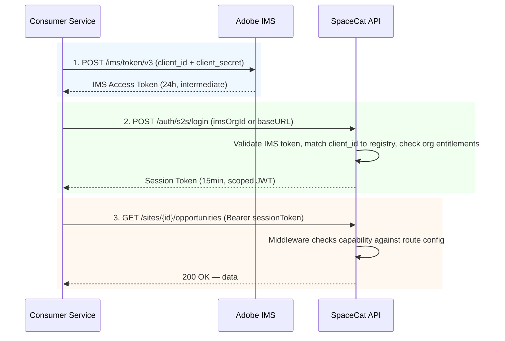

# MystiCat Service to Service Communications 

> **Audience**: Engineering / Product stakeholders
> **Goal**: Understand the problem, design decisions, flow, and trade-offs — no deep-dive into code

---

## The Problem: Why S2S Exists

Services like **Mystique, DRS, and Cursor** need programmatic access to SpaceCat APIs to read customer data — site configs, audits, opportunities, suggestions.

Until now they used **Legacy API Keys** for this. That's going away:

```
┌──────────────────────────────────────────────────────────────────┐
│  Legacy API Keys — why they must go                              │
│                                                                  │
│  • Arch 2.0 will not migrate them                                │
│  • Security ticket TechDebtSITES-34224 (severity: CRITICAL)      │
│    mandates removal of deprecated ASO API Token support          │
│  • No per-consumer identity — a leaked key = all doors open      │
│  • No scoping — same key works for any endpoint                  │
│  • No clean revocation per service                               │
└──────────────────────────────────────────────────────────────────┘
```

S2S is the replacement: every calling service gets its own **Technical Account (TA)** with a defined set of capabilities.

---

## Design Decision: Which Approach?

Two approaches were discussed before settling on the current design.

### Option A — Service Principal User (Deferred)

Suggested by the IMS team — the same pattern AEM Content API uses.  
The idea: provision a TA inside *each customer's org* and grant required scopes there.

**Why we didn't go this way:**  
Provisioning a TA per customer org at SpaceCat's scale is operationally complex. The scoping model doesn't map cleanly onto SpaceCat's route-level capability system. Deferred — not ruled out forever, but not the right fit here.

### Option B — Per-Consumer Vanilla TA ✅ (Chosen)

Each consuming service (Mystique, DRS, Cursor…) gets **one dedicated Technical Account in a trusted internal org** (`Sites Internal` in prod). That TA is registered in SpaceCat's consumer registry with a specific capability list.

```
┌─────────────────────────────────────────────────────────────┐
│  Per-Consumer TA benefits                                   │
│                                                             │
│  Individual revocability  → rotate one consumer's creds     │
│                             without touching others         │
│  Per-consumer audit trail → know which service accessed what│
│  Reduced blast radius     → a leaked credential is scoped   │
│                             to one consumer's capabilities  │
│  Clean lifecycle          → ACTIVE → SUSPENDED → REVOKED    │
└─────────────────────────────────────────────────────────────┘
```

---

## System Actors

```
┌──────────────────┐     ┌─────────────────────┐     ┌─────────────────────┐
│  Consumer Team   │     │   S2S Admin         │     │  Adobe IMS / Dev    │
│  (Mystique, DRS  │     │  (mysticat-s2s-admin│     │  Console            │
│   Cursor, etc.)  │     │   group)            │     │  (allowed org only) │
└────────┬─────────┘     └────────┬────────────┘     └──────────┬──────────┘
         │  JIRA request          │                             │
         │──────────────────────► │  Reviews capabilities       │
         │                        │  Creates Technical Account  │
         │                        │────────────────────────────►│
         │                        │◄────────────────────────────│
         │                        │  Registers consumer in      │
         │◄───────────────────────│  SpaceCat + stores creds    │
         │  Creds in secret mgr   │  in consumer's vault        │
```

---

## Allowed IMS Organizations

Technical Accounts must be provisioned in one of SpaceCat's trusted internal orgs. Tokens from any other org are rejected at registration.


| Environment | Org Name                 | IMS Org ID                          |
| ----------- | ------------------------ | ----------------------------------- |
| Stage / Dev | AEM Sites Optimizer UAT2 | `ACCF1A6467D1F49A0A49400C@AdobeOrg` |
| Production  | Sites Internal           | `908936ED5D35CC220A495CD4@AdobeOrg` |


This allowlist is a hard gate — it prevents external orgs from self-registering as consumers.

---

## Authentication Flow (Runtime)

Every API call from a consumer goes through a **2-step token exchange**.




### Why two tokens?

The IMS token proves **who you are** (your Technical Account identity).  
The SpaceCat session token carries **what you can do** (your capabilities) and **whose data you can see** (one specific org).

Separating them means SpaceCat can change or revoke a consumer's permissions instantly — without involving IMS at all.

### Token Lifetimes at a Glance


| Token                           | TTL            | Notes                                                                            |
| ------------------------------- | -------------- | -------------------------------------------------------------------------------- |
| **Session Token** (SpaceCat)    | **15 minutes** | The token used for all API calls. Cache it and refresh ~2 min before expiry.     |
| IMS Access Token (intermediate) | 24 hours       | Only needed to obtain a new session token. Cache it with a 5 min refresh buffer. |


> **Serverless / Lambda note**: In-memory caching of tokens doesn't persist across invocations. Use an external cache (Redis, ElastiCache) to avoid re-authenticating on every call.

---

## Scoped Session Tokens — The Design Intent

When a consumer calls `/auth/s2s/login` it must pass either an `imsOrgId` or a `baseURL`. SpaceCat uses this to issue a **single-org scoped JWT**:

```json
{
  "sub": "technical-account-id",
  "actor": "mystique",
  "tenants": ["CUSTOMER_ORG_ID@AdobeOrg"],
  "capabilities": ["site:read", "experiments:read", "suggestions:write"],
  "exp": "<now + 15 min>"
}
```

**Why deliberately constrain to one org per token?**

- Reduces blast radius from *"all orgs, all operations"* to *"one org, 15 minutes"*
- Creates an explicit per-org audit trail — you can see exactly which service touched which org's data and when
- Prevents accidental cross-tenant data leakage; a consumer must make a conscious token request per org
- If a consumer needs to operate across multiple orgs (e.g., a platform aggregation job), it requests a separate session token for each org — each hop is logged

---

## Capability Model & Enforcement

SpaceCat maintains a **consumer registry** mapping each TA `client_id` to a service name and its approved capabilities.

### Real Consumer Examples

```
Mystique:  site:read, experiments:read, keywords:read, suggestions:write
DRS:       site:read, content:read
Cursor:    site:read, experiments:read
```

### Capability definition

capabilities is structrured in `entity:operation` fashion and each route in api-service is assign with one capability. for example

`'GET /sites/:siteId/opportunities': 'opportunity:read'`

### Capability Tiers

```
site:read          ← fast approved (read-only is low risk)
audit:read
opportunity:read

audit:write        ← needs business justification
opportunity:write

site:write         ← RESTRICTED, exec approval required
organization:write ← RESTRICTED, exec approval required
fixEntity:write    ← NEVER GRANTED (internal use only)
*:*                ← INVALID (wildcards not supported)
```

### Two Enforcement Layers

```
Incoming request with Session Token
         │
         ▼
┌────────────────────────────────────────────────────────┐
│  Layer 1 — Route Middleware (primary)                  │
│                                                        │
│  Every route carries a capability annotation:          │
│  { path: '/sites/:id', method: 'GET',                  │
│    capability: 'site:read' }                           │
│                                                        │
│  Before the handler runs, middleware validates that    │
│  the session token's capabilities include the route's  │
│  required capability. Request rejected here if not.    │
└────────────────────────────────────────────────────────┘
         │  (if passes)
         ▼
┌────────────────────────────────────────────────────────┐
│  Layer 2 — Runtime Consumer Status & Capability Check  │
│                                                        │
│  Even with a valid, unexpired session token, SpaceCat  │
│  re-checks the consumer's live status and capabilities │
│  from the registry on each request.                    │
│                                                        │
│  Handles stale tokens: if a consumer was SUSPENDED     │
│  or had capabilities reduced after the session token   │
│  was issued, the change takes effect immediately —     │
│  no need to wait for the 15-min token to expire.       │
└────────────────────────────────────────────────────────┘
         │
         ▼
      Handler runs → data returned
```

This means capability changes and suspensions are enforced in real time, not deferred to the next token refresh.

---

## Consumer Lifecycle

```
                    ┌──────────────┐
                    │  JIRA Ticket  │  (label: mysticat-s2s-request)
                    └──────┬───────┘
                           │  S2S Admin approves + provisions
                           ▼
               ┌───────────────────────┐
               │  ACTIVE               │◄──────────────────┐
               │  Calling API normally │    reactivate      │
               └───────┬───────────────┘                   │
                       │ suspend                           │  (toggle freely)
                       ▼                                   │
               ┌───────────────────────┐                   │
               │  SUSPENDED            │───────────────────┘
               │  Temporary block      │
               └───────┬───────────────┘
                       │ revoke
                       │ (can also revoke directly from ACTIVE)
                       ▼
               ┌───────────────────────┐
               │  REVOKED              │  ← terminal state, no way back
               │  Permanent block      │
               │  Record kept for      │
               │  audit trail only     │
               └───────────────────────┘
```


| State     | Transition Rules                                                                           |
| --------- | ------------------------------------------------------------------------------------------ |
| ACTIVE    | Can be suspended or revoked                                                                |
| SUSPENDED | Can toggle back to ACTIVE freely (as many times as needed), or be revoked                  |
| REVOKED   | Terminal — no transition out. Re-access requires registering a brand-new Technical Account |


---

## Onboarding Flow (End-to-End)

```
Consumer Team                    S2S Admin                  Systems
─────────────────────────────────────────────────────────────────────
1. File JIRA ticket
   (endpoints needed,
    use-case description,
    multi-org? Y/N)

                                 2. Review capabilities
                                    Scrutinize any :write

                                 3. Create OAuth S2S credential
                                    in Dev Console
                                    (must use allowed IMS org)

                                 4. POST /consumers/register
                                    (dev / stage first)
                                                              ← Slack: #spacecat-services-dev

5. Test in dev environment
   Validate all endpoints
   Confirm capabilities OK

                                 6. POST /consumers/register
                                    (production, same payload)
                                                              ← Slack: #spacecat-services

7. Deploy to production
   Monitor for 401/403
```

> **Dev → Prod rule**: Production registration only happens after consumer team explicitly confirms dev is working. No exceptions.

---

## Secret Rotation

Uses a **dual-credential overlap** — no service downtime during rotation.

```
Timeline ──────────────────────────────────────────────────────────►

[Old Secret]  ████████████████████████████████████░░░░░  ← deleted
[New Secret]              ████████████████████████████████████████
                          ▲                    ▲
                     S2S Admin            Consumer team
                     adds new secret      deploys + confirms
                     in Dev Console
                                               ▲
                                       S2S Admin checks "Last Used"
                                       timestamp → deletes old
                                       (wait 24-48h in prod)
```

Secrets are distributed exclusively via vault/share Secrets — never shared over Slack or email.

### Emergency Rotation (Compromised Credentials)

```
1. Consumer team notifies S2S Admin immediately
2. S2S Admin SUSPENDS consumer   → unauthorized access blocked
3. S2S Admin adds new secret in Dev Console
4. Consumer team emergency-deploys with new secret (same day)
5. S2S Admin re-ACTIVATES consumer
6. S2S Admin deletes old secret once new deployment confirmed
```

---

## Relationship to AEM Content API (CAPI)

SpaceCat also calls AEM Content API (CAPI) internally — for operations like autofix. This is a **separate auth system** and the two must not be confused or merged.

```
┌───────────────────────────────────┬──────────────────────────────────┐
│  SpaceCat S2S (System 1)          │  AEM CAPI S2S (System 2)         │
├───────────────────────────────────┼──────────────────────────────────┤
│  Protects SpaceCat's API boundary │  Protects AEM's content boundary │
│  (inbound to SpaceCat)            │  (outbound from SpaceCat)        │
│  Token: custom ES256 JWT, 15 min  │  Token: standard IMS access token│
│  AuthZ: capability per route      │  AuthZ: IMS service principal    │
│  Owner: SpaceCat team             │  Owner: AEM security team        │
└───────────────────────────────────┴──────────────────────────────────┘
```

### Credential Gateway Pattern

When an S2S consumer triggers an operation that ultimately writes to a customer's AEM instance, two separate credential hops are involved:

```
External Consumer (Mystique, DRS…)
    │  SpaceCat Session Token
    │  (System 1 — "who are you, what can you do in SpaceCat?")
    ▼
SpaceCat API  →  validates capability + org scope
    │  SQS message (carries consumer identity for audit)
    ▼
SpaceCat Internal Worker (e.g. autofix-worker)
    │  IMS Service Principal Token
    │  (System 2 — "SpaceCat speaking to AEM")
    ▼
AEM Content API  →  Customer AEM CS instance
```

Key properties:

- No token crosses both boundaries — the consumer authenticates *to SpaceCat*; SpaceCat authenticates *to AEM*
- No credentials are shared — the consumer never sees SpaceCat's CAPI client credentials
- SpaceCat's CAPI credential is per internal service (one per worker), not per consumer

---

## Security & Observability

### Rate Limiting & Alerting

- Rate limiting is enforced on `/auth/s2s/login` per Technical Account
- An coralogix alert fires on #spacecat-ops if a single TA requests tokens for an unusual spread of orgs
- Future: Use coralogix alert payload to create skyline on-call trigger, ticket to follow https://jira.corp.adobe.com/browse/AEMSRE-3408

### Audit Trail

Every S2S token issuance is logged: consumer name, org_id, timestamp, caller IP. for example:

`[jwt] S2S consumer XXX-XXXXX-XXXX token used on route GET /sites/123435-78978-490`

Every lifecycle event (register, update, suspend, revoke) fires a Slack notification:
example:


| Event       | Channel                           |
| ----------- | --------------------------------- |
| Dev / Stage | `#s2s-services-dev` |
| Production  | `#s2s-spacecat-notifications-dev` |


Consumer records are **never deleted** — revoked consumers remain in the database with a `revokedAt` timestamp for forensics.

---

## Limitations & Known Constraints


| #   | Limitation                                | Detail                                                                                                                                               |
| --- | ----------------------------------------- | ---------------------------------------------------------------------------------------------------------------------------------------------------- |
| 1   | **15-min session TTL**                    | Frequent re-login required. Lambda/serverless consumers must use external cache (Redis) — in-memory doesn't survive across invocations               |
| 2   | **No wildcard capabilities**              | Must list each `entity:operation` explicitly — `audit:`* is invalid                                                                                  |
| 3   | **Immutable identity fields**             | `clientId`, `technicalAccountId`, `imsOrgId` cannot change after registration. Credential change = full re-registration with a new TA                |
| 4   | **Revocation is permanent**               | No undo path. A revoked consumer must register a brand-new Technical Account                                                                         |
| 5   | **Narrow IMS org allowlist**              | Only 1 trusted org per environment. Teams in other orgs cannot self-register                                                                         |
| 6   | **Admin bottleneck**                      | All lifecycle ops require `is_s2s_admin` flag — no self-service for consumers                                                                        |
| 7   | **Per-org token for multi-org workflows** | A consumer hitting multiple customer orgs must request a separate session token per org — intentional for audit, but adds latency to cross-org flows |
| 8   | **Autofix not yet S2S-accessible**        | Internal routes excluded from S2S until confused-deputy risk is addressed (see above)                                                                |


---

## Quick API Reference (Admin Only)

```
GET  /consumers                          ← list all registered consumers
GET  /consumers/{id}                     ← get by consumer ID
GET  /consumers/by-client-id/{clientId} ← look up by OAuth client ID
POST /consumers/register                 ← onboard new consumer
PATCH /consumers/{id}                    ← update name / capabilities / status
POST /consumers/{id}/revoke              ← permanent revoke (irreversible)
```

---

## Summary

```
┌──────────────────────────────────────────────────────────────────┐
│ SpaceCat S2S Design Principles                                   │
│                                                                  │
│  Zero-trust      → no capability = no access, checked every call │
│  Least privilege → request only what you need, upgrade via JIRA  │
│  Org isolation   → one session token per org, intentional        │
│  Auditability    → every issuance + lifecycle event logged       │
│  Separation      → IMS proves identity, SpaceCat enforces scope  │
│  Safety valve    → suspend (reversible) before revoke (forever)  │
└──────────────────────────────────────────────────────────────────┘
```

