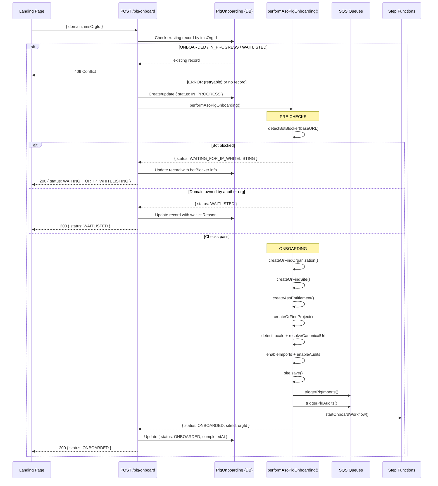
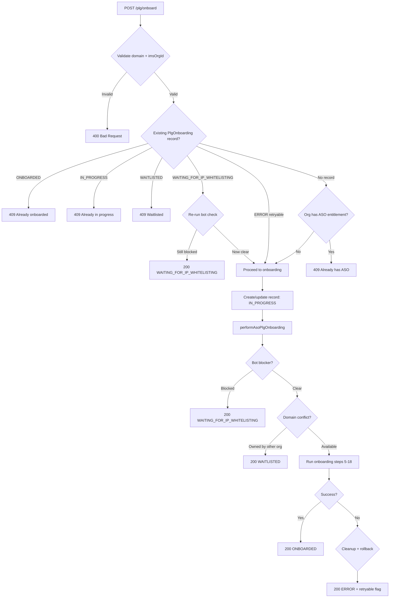
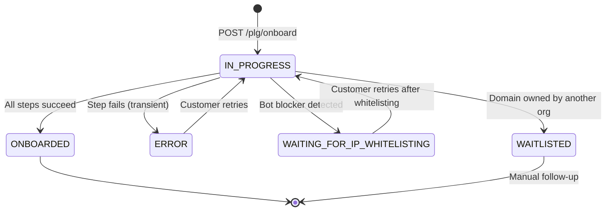

# PLG Onboarding Backend — Implementation Plan

## Overview

ASO is launching a PLG (Product-Led Growth) motion. Customers will be able to self-onboard into ASO directly from a landing page — no ESE involvement, no Slack, fully automated.

The frontend (`aso-plg-landing-page`) handles the customer-facing UI. This plan covers the **backend API** in `spacecat-api-service` that powers it: a new `POST /plg/onboard` endpoint that creates the org, site, entitlement, enables audits/imports, and tracks the onboarding lifecycle in a new `PlgOnboarding` data model.

---

## Flow Diagrams

### End-to-End Request Flow



### `POST /plg/onboard` — Controller Decision Tree



### `performAsoPlgOnboarding()` — Step-by-Step Flow

### Status State Machine



---

## Architecture Decisions

| Decision | Choice | Rationale |
|----------|--------|-----------|
| Sync vs Async | **Sync** (like LLMO) | Setup steps are DB writes + SQS sends + Step Functions start — takes seconds. Audits/imports are already async via SQS. LLMO `performLlmoOnboarding()` proves this works. |
| Code pattern | **Follow LLMO pattern** | Write new `performAsoPlgOnboarding()` reusing LLMO's clean helpers. Don't touch `onboardSingleSite()` or `utils.js`. Zero risk to existing Slack flow. |
| All checks inside endpoint | **Single endpoint** | Bot blocker, domain conflict, entitlement check — all in `POST /plg/onboard`. No separate pre-flight endpoint. |
| State tracking | **New PlgOnboarding model** | PLG is self-service with no human in the loop. The DB record tracks lifecycle, enables retry, and gives admin visibility. |
| Auth | **Scoped API key** | Landing page service holds the key. Scoped to PLG routes specifically. |
| Existing Slack flow | **Untouched** | `onboardSingleSite()` in `utils.js`, all Slack commands and actions — zero modifications. |

### Key References

| Reference | Location |
|-----------|----------|
| Existing ASO onboarding (Slack) | `src/support/utils.js` — `onboardSingleSite()` (line 1083) |
| LLMO onboarding API (pattern to follow) | `src/controllers/llmo/llmo-onboarding.js` — `performLlmoOnboarding()` (line 982) |
| LLMO clean helpers | `src/controllers/llmo/llmo-onboarding.js` — `createOrFindOrganization` (line 563), `createOrFindSite` (line 741), `enableAudits` (line 893), `enableImports` (line 918) |
| PLG profile | `static/onboard/profiles.json` (lines 24-48) — audits and imports config |
| Bot blocker detection | `detectBotBlocker({ baseUrl })` from `@adobe/spacecat-shared-utils` — works with URL directly, no siteId needed |

---

## Part 1 — PlgOnboarding Model (spacecat-shared-data-access)

Cross-package change in `@adobe/spacecat-shared-data-access`. **Blocking dependency — must land before API work begins.**

Full schema from day 1. Optional fields are cheap to have and avoid future migrations.

### Schema

**Identity**

| Field | Type | Required | Purpose |
|-------|------|----------|---------|
| `plgOnboardingId` | UUID (auto) | Yes | Primary key, auto-generated |
| `imsOrgId` | string | Yes | Main lookup key — frontend asks "what's my org's status?" |
| `domain` | string | Yes | User-provided domain input (e.g. `example.com`) |
| `baseURL` | string | Yes | Normalized via `composeBaseURL(domain)` (e.g. `https://www.example.com`) |

**Status**

| Field | Type | Required | Purpose |
|-------|------|----------|---------|
| `status` | enum | Yes | `IN_PROGRESS` · `ONBOARDED` · `ERROR` · `WAITING_FOR_IP_WHITELISTING` · `WAITLISTED` |

**References** (populated as onboarding progresses)

| Field | Type | Required | Purpose |
|-------|------|----------|---------|
| `siteId` | string | No | Set after site creation |
| `organizationId` | string | No | Set after org created/found |

**Progress tracking**

| Field | Type | Required | Purpose |
|-------|------|----------|---------|
| `steps` | map | No | Booleans: `{ orgCreated, siteCreated, entitlementCreated, auditsEnabled, importsEnabled, workflowStarted }`. Enables retry (skip completed steps) and status display. |

**Error info** (when status = `ERROR`)

| Field | Type | Required | Purpose |
|-------|------|----------|---------|
| `error` | map | No | `{ code, message, details }` — same pattern as AsyncJob |
| `retryable` | boolean | No | Can the customer retry, or is it a permanent failure? |

**Bot blocker info** (when status = `WAITING_FOR_IP_WHITELISTING`)

| Field | Type | Required | Purpose |
|-------|------|----------|---------|
| `botBlocker` | map | No | `{ type, ipsToWhitelist, userAgent }` — info the customer needs to whitelist our crawler |

**Waitlist info** (when status = `WAITLISTED`)

| Field | Type | Required | Purpose |
|-------|------|----------|---------|
| `waitlistReason` | string | No | Why they were waitlisted (e.g. "Domain owned by another organization") |

**Timestamps**

| Field | Type | Required | Purpose |
|-------|------|----------|---------|
| `createdAt` | string | Auto | From BaseModel |
| `updatedAt` | string | Auto | From BaseModel |
| `completedAt` | string | No | When status became `ONBOARDED` |

### Indexes

| Index | Partition Key | Sort Key | Query |
|-------|--------------|----------|-------|
| by imsOrgId | `imsOrgId` | `updatedAt` | `findByImsOrgId('ABC@AdobeOrg')` — main frontend lookup |
| by status | `status` | `updatedAt` | `allByStatus('WAITLISTED')` — admin dashboard, find stuck onboardings |
| by domain | `domain` | `status` | `findByDomain('https://example.com')` — duplicate check. App logic filters: active = status NOT IN (`ERROR`) |

### Status Transitions

```
[new request] -----> IN_PROGRESS -----> ONBOARDED
                         |
                         +-----> ERROR (retryable) ---[retry]---> IN_PROGRESS
                         |
                         +-----> WAITING_FOR_IP_WHITELISTING ---[retry after whitelist]---> IN_PROGRESS
                         |
                         +-----> WAITLISTED (manual follow-up needed)
```

### Files in spacecat-shared-data-access

```
src/models/plg-onboarding/
  plg-onboarding.model.js
  plg-onboarding.collection.js
  plg-onboarding.schema.js
  index.js
  index.d.ts
```

Register in `src/models/base/entity.registry.js`.

---

## Part 2 — `performAsoPlgOnboarding()`

New file: `src/controllers/plg/plg-onboarding.js`

### Helper Reuse Map

| What | Reuse from LLMO | ASO Slack version (don't touch) |
|------|----------------|-------------------------------|
| Find/create org | `createOrFindOrganization(imsOrgId, context)` | `createSiteAndOrganization(…, slackContext, reportLine, …)` |
| Find/create site | `createOrFindSite(baseURL, orgId, context, deliveryType)` | Part of `createSiteAndOrganization` |
| Enable audits | `enableAudits(site, context, audits)` | Inline in `onboardSingleSite` with slackContext |
| Enable imports | `enableImports(siteConfig, imports, log)` | Inline in `onboardSingleSite` with slackContext |

### New PLG-Specific Functions

| Function | Purpose |
|----------|---------|
| `createAsoEntitlement(site, context)` | Like LLMO's `createEntitlementAndEnrollment` but with `ASO` product code and `FREE_TRIAL` tier |
| `createOrFindProject(baseURL, orgId, context)` | Clean version of `utils.js:713` — find by org + derived name, or create |
| `triggerPlgAudits(site, context, auditTypes)` | Send SQS messages to audit queue without slackContext |
| `triggerPlgImports(site, config, context, importTypes)` | Send SQS messages to import queue without slackContext |
| `startOnboardWorkflow(site, context, env)` | Start Step Functions with empty `slackContext: {}` in payloads |
| `checkBotBlocker(baseURL)` | Calls `detectBotBlocker({ baseUrl })` from `@adobe/spacecat-shared-utils` — works with URL directly, no siteId needed |

### Flow

```
performAsoPlgOnboarding({ domain, imsOrgId }, context):

  PRE-CHECKS (before creating anything):
    1. baseURL = composeBaseURL(domain)
    2. detectBotBlocker({ baseUrl: baseURL })
       → blocked? return { status: WAITING_FOR_IP_WHITELISTING, botBlocker }
    3. existingSite = Site.findByBaseURL(baseURL)
       → exists + owned by different org? return { status: WAITLISTED, reason }
    4. deliveryType = findDeliveryType(baseURL)

  ONBOARDING (LLMO pattern):
    5. organization = createOrFindOrganization(imsOrgId, context)
    6. site = createOrFindSite(baseURL, organization.getId(), context, deliveryType)
    7. createAsoEntitlement(site, context)
    8. project = createOrFindProject(baseURL, organization.getId(), context)
    9. site.setProjectId(project.getId())
    10. detectLocale → site.setLanguage(), site.setRegion()
    11. plgProfile = load PLG profile from profiles.json
    12. enableImports(siteConfig, plgProfile.imports)
    13. resolveCanonicalUrl → update overrideBaseURL if needed
    14. site.save()
    15. enableAudits(site, context, plgProfile.audits)
    16. triggerPlgImports(...)
    17. triggerPlgAudits(...)
    18. startOnboardWorkflow(...)

  SUCCESS: return { status: ONBOARDED, site, siteId, organizationId, baseURL }
  FAILURE: cleanup (revoke entitlement if created), return { status: ERROR, error, retryable }
```

### Step Functions Workflow

Reuse the existing `ONBOARD_WORKFLOW_STATE_MACHINE_ARN`. The processors receive `slackContext: {}` (empty) and should handle it gracefully:

| Job | PLG needs it? | Notes |
|-----|---------------|-------|
| `opportunity-status-processor` | Yes | Checks if audits completed. Slack reporting no-ops with empty context. |
| `disable-import-audit-processor` | Yes | PLG profile has `scheduledRun: false` — must disable one-time audits/imports after they run. |
| `demo-url-processor` | No | Sends demo URL to Slack. No-ops with empty slackContext. |
| `cwv-demo-suggestions-processor` | Maybe | Adds generic CWV suggestions. No-ops or runs fine with empty slackContext. |

### Error Handling and Rollback

Follow LLMO pattern (`performLlmoOnboarding` catch block, `llmo-onboarding.js:1100`):

- Entitlement created → revoke on failure via `TierClient.revokeSiteEnrollment()`
- Site created by us (not pre-existing) → consider cleanup
- Update PlgOnboarding record to `ERROR` with details
- `retryable: true` for transient errors (timeouts, service unavailable), `false` for permanent (invalid data, conflicts)

---

## Part 3 — Endpoints

### `POST /plg/onboard`

**Auth:** Scoped API key

**Request:**
```json
{
  "domain": "example.com",
  "imsOrgId": "ABC123@AdobeOrg"
}
```

**Controller flow:**

1. Validate `domain` + `imsOrgId`
2. Check existing PlgOnboarding record by `imsOrgId`:
   - `ONBOARDED` → 409 "Already onboarded"
   - `IN_PROGRESS` → 409 "Onboarding already in progress"
   - `WAITING_FOR_IP_WHITELISTING` → re-run bot check. Clear now? Proceed. Still blocked? Return same status.
   - `WAITLISTED` → 409 "Waitlisted, contact support"
   - `ERROR` → allow retry (proceed to step 3)
3. Check org already has ASO entitlement → 409
4. Create/update PlgOnboarding record: `{ status: IN_PROGRESS }`
5. Call `performAsoPlgOnboarding()`
6. Update record based on result:
   - `ONBOARDED` → set `{ siteId, orgId, steps: all true, completedAt }`
   - `WAITING_FOR_IP_WHITELISTING` → set `{ botBlocker: { type, ips, userAgent } }`
   - `WAITLISTED` → set `{ waitlistReason }`
   - `ERROR` → set `{ error: { code, message }, retryable }`
7. Return the PlgOnboarding record

**Responses:**

Success (200):
```json
{
  "plgOnboardingId": "uuid",
  "status": "ONBOARDED",
  "domain": "example.com",
  "baseURL": "https://www.example.com",
  "imsOrgId": "ABC123@AdobeOrg",
  "siteId": "uuid",
  "organizationId": "uuid",
  "steps": {
    "orgCreated": true,
    "siteCreated": true,
    "entitlementCreated": true,
    "auditsEnabled": true,
    "importsEnabled": true,
    "workflowStarted": true
  },
  "completedAt": "2026-03-03T10:30:00.000Z"
}
```

Bot blocked (200):
```json
{
  "plgOnboardingId": "uuid",
  "status": "WAITING_FOR_IP_WHITELISTING",
  "domain": "example.com",
  "baseURL": "https://www.example.com",
  "imsOrgId": "ABC123@AdobeOrg",
  "botBlocker": {
    "type": "cloudflare",
    "ipsToWhitelist": ["203.0.113.0/24"],
    "userAgent": "SpaceCat/1.0"
  }
}
```

Waitlisted (200):
```json
{
  "plgOnboardingId": "uuid",
  "status": "WAITLISTED",
  "domain": "example.com",
  "baseURL": "https://www.example.com",
  "imsOrgId": "ABC123@AdobeOrg",
  "waitlistReason": "Domain owned by another organization"
}
```

Error (200):
```json
{
  "plgOnboardingId": "uuid",
  "status": "ERROR",
  "domain": "example.com",
  "baseURL": "https://www.example.com",
  "imsOrgId": "ABC123@AdobeOrg",
  "error": {
    "code": "ENTITLEMENT_FAILED",
    "message": "Tier client timeout"
  },
  "retryable": true
}
```

Rejections:
| Code | When |
|------|------|
| 400 | Invalid domain or imsOrgId |
| 409 | Already onboarded / in progress / waitlisted |

### `GET /plg/onboard/status`

**Auth:** Scoped API key

**Query:** `?imsOrgId=ABC123@AdobeOrg`

Simple DB lookup. Returns the latest PlgOnboarding record for this IMS org. Returns `404` if no record found.

---

## Part 4 — Wiring

### Routes (`src/routes/index.js`)

```javascript
'POST /plg/onboard': plgOnboardingController.onboard,
'GET /plg/onboard/status': plgOnboardingController.getStatus,
```

Wire `PlgOnboardingController` in `src/index.js` `getRouteHandlers()`.

---

## Part 5 — DTO and OpenAPI

### DTO

New file: `src/dto/plg-onboarding.js`

- `PlgOnboardingDto.fromRequest(data)` — validate and normalize request input
- `PlgOnboardingDto.toJSON(record)` — transform PlgOnboarding model to API response (never expose raw model)

### OpenAPI

- New: `docs/openapi/plg-onboarding-api.yaml` — path definitions
- Add schemas to `docs/openapi/schemas.yaml`: `PlgOnboardingRequest`, `PlgOnboardingResponse`
- Add examples to `docs/openapi/examples.yaml`
- Reference in `docs/openapi/api.yaml`
- Validate: `npm run docs:lint` and `npm run docs:build`

---

## Part 6 — Tests

### Unit Tests

| File | Covers |
|------|--------|
| `test/controllers/plg/plg-onboarding.test.js` | Controller: `onboard`, `getStatus` |
| `test/controllers/plg/plg-onboarding-core.test.js` | `performAsoPlgOnboarding()` + all new helpers |
| `test/dto/plg-onboarding.test.js` | DTO transformations |

Test cases:
- Happy path: domain + imsOrgId → ONBOARDED
- Bot blocked: detectBotBlocker returns blocked → WAITING_FOR_IP_WHITELISTING
- Domain conflict: site exists under different org → WAITLISTED
- Already onboarded: existing record with ONBOARDED → 409
- Retry after ERROR: existing ERROR record → allowed, runs onboarding
- Retry after WAITING_FOR_IP_WHITELISTING: bot check now clear → proceeds
- Invalid input: bad domain → 400, bad imsOrgId → 400
- Onboarding failure: entitlement creation fails → ERROR with rollback
- Access control: valid scoped API key required

### Integration Tests

| File | Purpose |
|------|---------|
| `test/it/shared/seed-ids.js` | Add PLG seed IDs |
| `test/it/shared/tests/plg-onboarding.js` | Shared test factory |
| `test/it/dynamo/seed-data/` | PLG seed data (camelCase) |
| `test/it/postgres/seed-data/` | PLG seed data (snake_case) |
| `test/it/dynamo/plg-onboarding.test.js` | DynamoDB wiring |
| `test/it/postgres/plg-onboarding.test.js` | PostgreSQL wiring |

---

## Files Summary

### New (spacecat-api-service)

| File | Purpose |
|------|---------|
| `src/controllers/plg/plg-onboarding.js` | `performAsoPlgOnboarding()` + helpers |
| `src/controllers/plg/plg.js` | Controller (`onboard`, `getStatus`) |
| `src/dto/plg-onboarding.js` | Request/response DTO |
| `docs/openapi/plg-onboarding-api.yaml` | OpenAPI spec |
| `test/controllers/plg/plg-onboarding.test.js` | Controller unit tests |
| `test/controllers/plg/plg-onboarding-core.test.js` | Core logic unit tests |
| `test/dto/plg-onboarding.test.js` | DTO unit tests |
| `test/it/shared/tests/plg-onboarding.js` | Integration test factory |

### Modified (spacecat-api-service)

| File | Change |
|------|--------|
| `src/routes/index.js` | Add 2 PLG routes |
| `src/index.js` | Wire `PlgOnboardingController` in `getRouteHandlers()` |
| `docs/openapi/schemas.yaml` | Add PLG schemas |
| `docs/openapi/examples.yaml` | Add PLG examples |
| `docs/openapi/api.yaml` | Reference PLG paths |
| `test/it/shared/seed-ids.js` | Add PLG seed IDs |

### New (spacecat-shared-data-access) — blocking dependency

| File | Purpose |
|------|---------|
| `src/models/plg-onboarding/plg-onboarding.model.js` | Model |
| `src/models/plg-onboarding/plg-onboarding.collection.js` | Collection |
| `src/models/plg-onboarding/plg-onboarding.schema.js` | Schema + indexes |
| `src/models/plg-onboarding/index.js` | Exports |
| `src/models/plg-onboarding/index.d.ts` | TypeScript types |
| `src/models/base/entity.registry.js` | Register new entity |

### NOT Modified

| File | Why |
|------|-----|
| `src/support/utils.js` | Untouched — existing Slack onboarding stays as-is |
| `src/support/slack/` | Untouched — all Slack commands and actions unchanged |
| `src/controllers/llmo/` | Untouched — LLMO helpers are imported, not modified |

---

## Open Questions

| Question | Impact | Notes |
|----------|--------|-------|
| Do Step Functions processors handle empty `slackContext: {}` gracefully? | If not, need small fix in processor lambdas before PLG can start the workflow | Check `opportunity-status-processor` and `disable-import-audit-processor` specifically |
| Scoped API key permissions | Which scopes does the PLG landing page key need? | Minimum: `plg.onboard`, `plg.status` or similar |
| PlgOnboarding model — DynamoDB only (v2) or also PostgreSQL (v3)? | Determines which data-access schema builder to use and IT test backends | Follow whatever the team's current migration strategy is |
